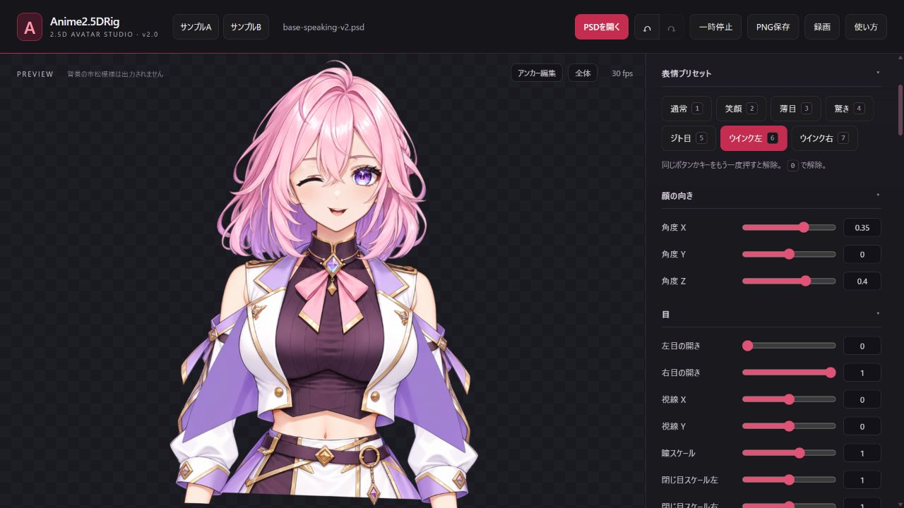
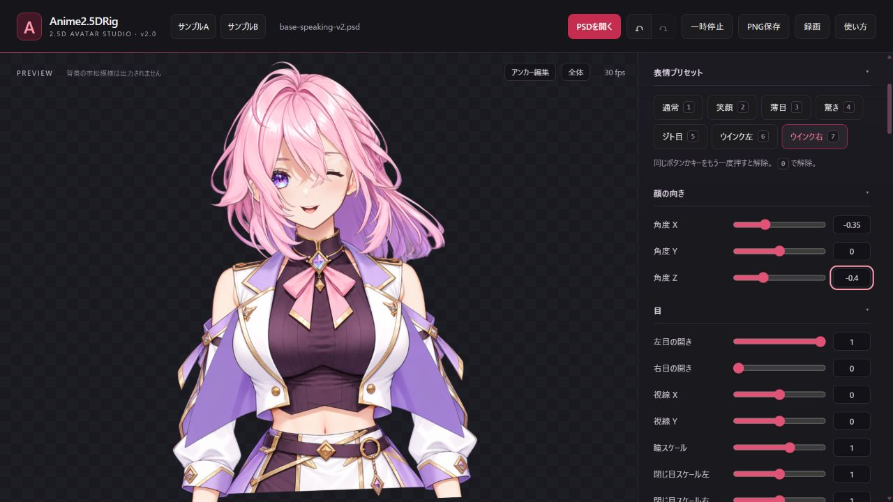
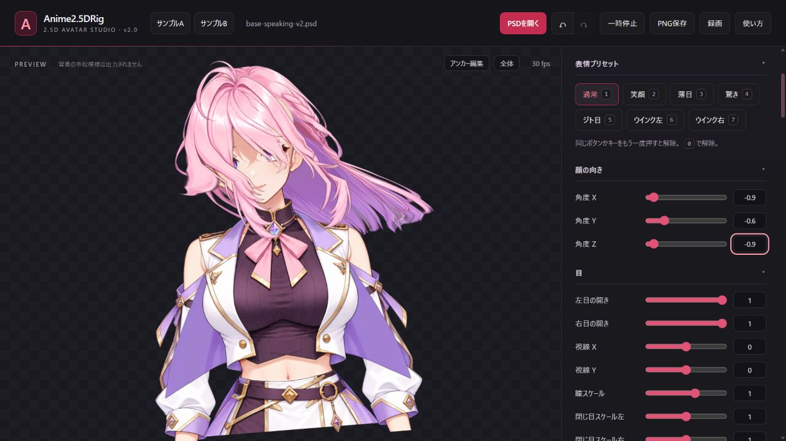
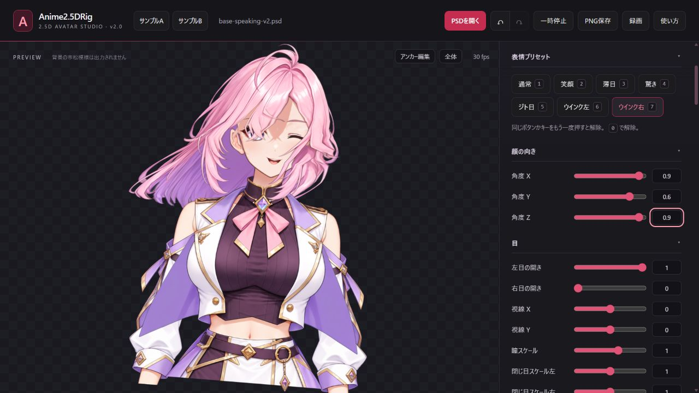
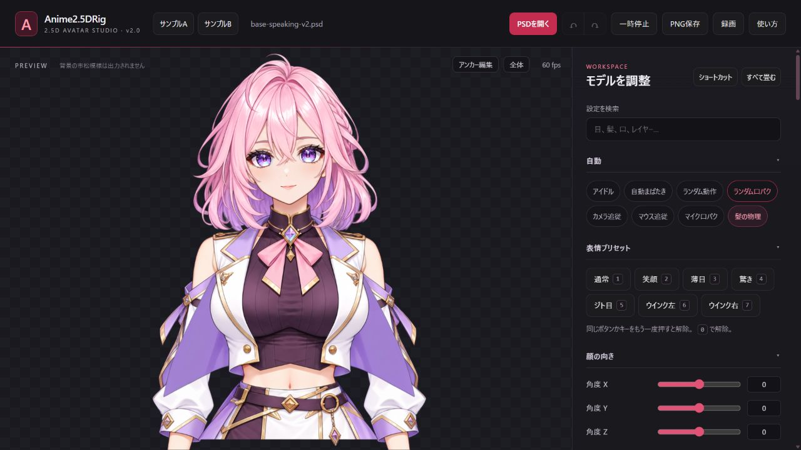
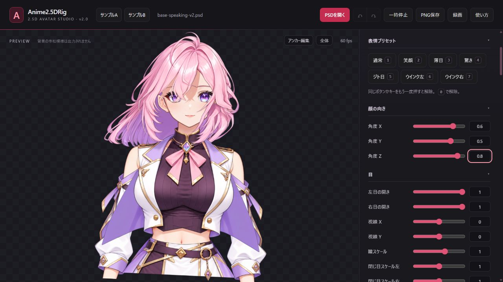
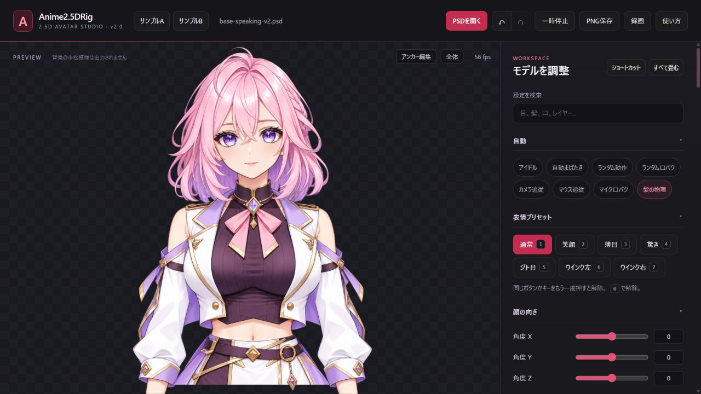
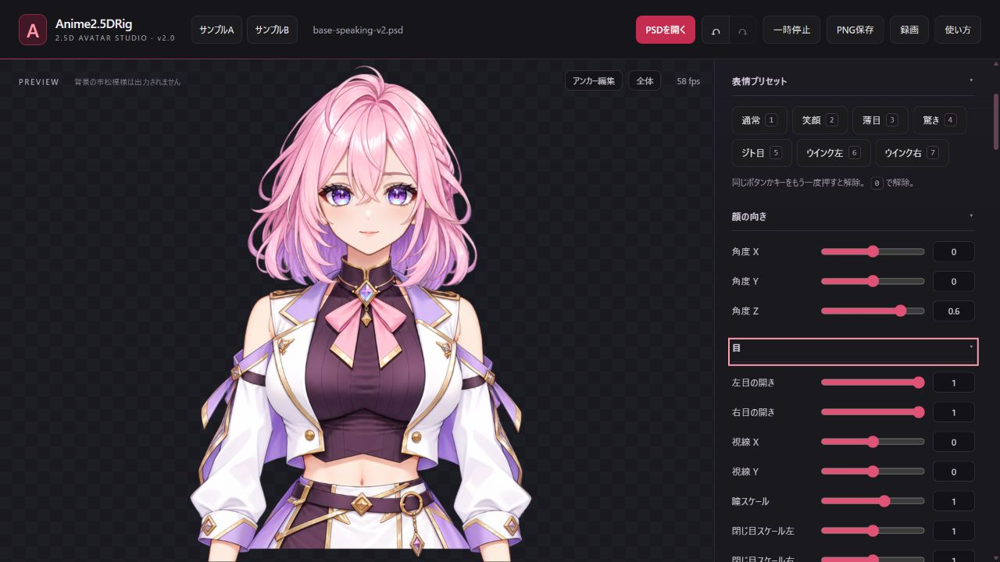
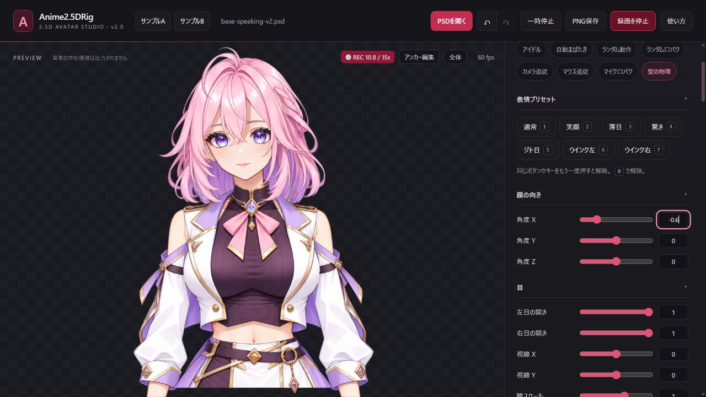
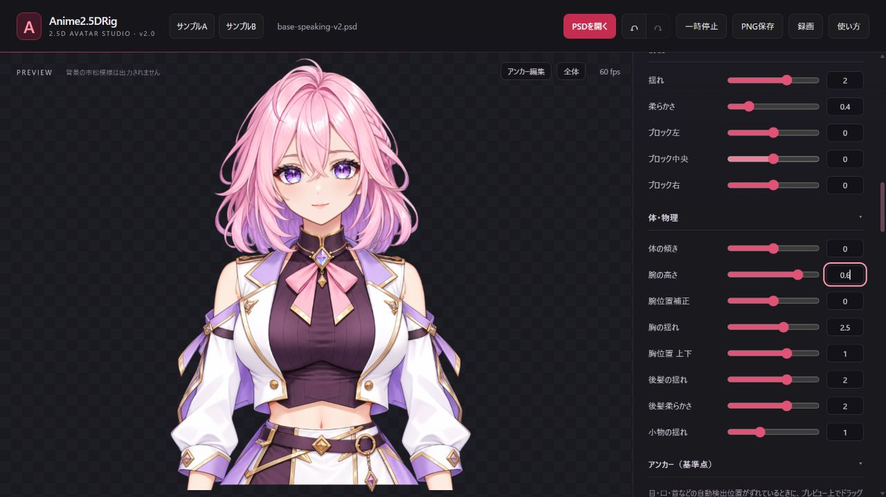

# 検証記録: 2026-09-30

## 現在の成果物

| ファイル | 確認内容 |
|---|---|
| `input/base.png` | 1254×1254 RGBAの元立ち絵 |
| `avatars/base-rig.psd` | 1280×1280、元の20レイヤー |
| `avatars/base-speaking-v2.psd` | 21レイヤー、元の20レイヤーの画素をすべて保持 |
| `avatars/base-speaking-v2.rig.json` | 改良PSDから書き出し、読み戻し成功。modelId `a6068e-293dc8a5-5f5ed455` |
| `preview/speaking-v2.webm` | VP9、1280×1280、108フレーム、最終時刻4.705秒。カメラ・マイクなし |
| `preview/speaking-neck-mask.webm` | 水平マスク時点の旧版。首が浮いて見える問題が残る。VP9、1280×1280、103フレーム、最終時刻4.663秒 |
| `preview/speaking-collar-fit.webm` | 襟への接続修正後。VP9、1280×1280、125フレーム、最終時刻4.957秒。カメラ・マイクなし |
| `preview/motion-v3.webm` | 最新の可動幅・横揺れ・呼吸改良後。VP9、1280×1280、146フレーム、最終時刻4.931秒。カメラ・マイクなし |

SHA256:

```text
input/base.png
103075e95db8d65f01581edde5e1b2f3d823c3fa2ce08d4cc8afa16e696f3da7
avatars/base-rig.psd
385fc62f099d5c81adb2e5739dce2f634c852014fc1b3e8ee2012043a8dd4374
avatars/base-speaking-v2.psd
a95f7d47883ce1f6071e470e2b440c2067dba57324f8bb57d8f64a58f9e0d84f
preview/speaking-neck-mask.webm
d3d39eb7fac1ca9421196500fd778d1252be058181f0ebca4aa574de8a9bbe5b
preview/speaking-collar-fit.webm
1e8224db53e81bf0d89a5847e01acbd8aeec0efbebff74af7c09d1432270ec68
preview/motion-v3.webm
97c6807a08065025465b13201aa4571b611a332f9dc1a203c063c441793c3d29
```

## 合格・観察済み

- [最新の追従・横揺れ・呼吸修正](https://github.com/naochan3/vtuber-dev/commit/f0191cb28c56465799e2c730711f41456fac1065) の [Actions](https://github.com/naochan3/vtuber-dev/actions/runs/36726749153) で独自の追従検査・公式Nodeテスト・Pages公開が成功。
- `tests/motion-profile.test.cjs`: 固定版FaceFeaturesに合成した顔の測定値を渡し、左右別のウィンクで反対の目が開いたまま、頭感度1.6による小さな角度の増幅を確認。描画側の合成カメラ入力で急な向き変更の平滑化、30/60fpsの間隔で同じ経過時間後の応答一致、目・口の速い反応を確認。
- 既存の標準設定だけを新しい頭感度・平滑化へ移行し、正面の記録と独自の感度を保持する検査に合格。一度移行後に目の連動をオンへ戻した操作も保持。
- 公開画面で頭感度1.6・なめらかさ0.65・目の連動オフを確認。左右のウィンク表示、X/Z=`±0.35/±0.4`、広いX/Y/Z=`±0.9/±0.6/±0.9`の手動ポーズを確認。首が手前の襟に隠れる接続を保持。実カメラのウィンク検出成功の証跡とはしない。
- 呼吸周期と連動した頭・体の横揺れが有限かつ範囲内で、位相差があることを合成入力で確認。呼吸は自動演出で、本人の呼吸を測定していない。

左右独立の目と、小さな手動角度の表示:




広げた可動幅の手動確認:




- Colab L4 / Python 3.12でSee-throughによる初版PSD生成成功。741.05秒は初回ダウンロード・20秒間隔の完了確認を含む。
- 左右12パーツの名前変換前後で合成画像が同一。
- v2の口追加で元の20レイヤーそれぞれの画素ハッシュ一致。開き口の配置範囲は `[618, 435, 678, 465]`。
- `prepare-tha3.py`、`normalize-psd.py`、`add-speaking-mouth.py`、`apply-rig-tuning.py` はColabでruff・mypy strict合格。
- ローカルの固定版調整確認で、初回適用・再適用・元ソース保管・未知ソースや別編集の拒否に合格。
- PowerShellの構文検査、改良JavaScriptのNode構文検査に合格。
- [コード公開コミット](https://github.com/naochan3/vtuber-dev/commit/07282c1f12b79bedcfc772dfc27c3b870cfd74d5) の [GitHub Actions](https://github.com/naochan3/vtuber-dev/actions/runs/36692956843) で公式NodeテストとPages公開が成功。
- [首マスク修正コミット](https://github.com/naochan3/vtuber-dev/commit/efd36f314ca60a0b552aed133bdf916e282a32a3) の [GitHub Actions](https://github.com/naochan3/vtuber-dev/actions/runs/36716876865) も成功。襟元を下げる試案を取り下げ、首の上側だけを衣装の前へ追加描画する方式に置き換え。
- 改良プレビューで専用開き口・元の閉じ口を認識。手動のX/Z=`+0.6/+0.8`、`−0.6/−0.8`で首・肩・胴体のつながりを画面確認。
- 水平マスク追加時点では上側の首を表示できたが、ユーザーの追加指摘で首下端と襟の間に隙間が残ると判明。この時点を首の接続修正の完成とは扱わない。
- [襟への接続修正コミット](https://github.com/naochan3/vtuber-dev/commit/49d59c909c8473776b65ff6796e1231fdc7c8e47) の [GitHub Actions](https://github.com/naochan3/vtuber-dev/actions/runs/36720435661) で公式NodeテストとPages公開が成功。
- 金色の襟縁で衣装を前後に分け、背面の襟→首（一度だけ）→前面の襟→顔の順へ変更。正面、X/Z=`−0.6/−0.8`、X/Y/Z=`+0.6/+0.5/+0.8`、Y=`−0.5`の手動ポーズで、水平なぶつ切りがなく首が襟の内側につながる表示を確認。
- 公式サンプルAへの切り替え後、v2のPSDとJSONを再読み込みし、描画・首マスク・口設定が復元されることを確認。GPUメモリ量の計測はしていません。
- 改良動画を既存FFmpegでデコードし、1秒間隔のフレームで開口と閉口・上半身の動きを確認。

正面の首と襟の接続修正結果:



傾き・上向きの手動ポーズ:



会社PCでは軽いファイル保存・構文検査・動画読み取り・ブラウザ操作のみ実施しました。Python依存環境・モデル・ドライバ・配信プラグインのインストールやOS設定変更は行っていません。ブラウザ描画の負荷はゼロではありません。

## 追加検証: 肩・胸の曲がり、瞳、毛束、垂れ布（2026-10-01）

- [動作修正](https://github.com/naochan3/vtuber-dev/commit/ecf8bc19bfc3f5f49ef18287c3f59881d3d20a2f) の [Actions](https://github.com/naochan3/vtuber-dev/actions/runs/36736103396)、[垂れ布の分離](https://github.com/naochan3/vtuber-dev/commit/91b1529c8e2f2e25135f9f65050f816d5fb37655) の [Actions](https://github.com/naochan3/vtuber-dev/actions/runs/36737001319) が成功。独自3種類の検査、公式Nodeテスト、Pages公開を通過。
- 全パーツの一律回転を除去。実際の変形関数へ合成点を渡し、肩と胸の変位差・腰側の保持・左右向きの対称性・頭幅の圧縮・最大入力でメッシュが裏返らないことを確認。
- 開眼後0.52秒の瞳の伸縮演出を除去。閉眼→再開眼を実際のanimateで再生し、瞳の追加倍率が常に1であることを確認。驚きは手動プリセットで、カメラの自動判定ではない。実カメラ中の違和感の原因をすべて確定したわけではない。
- 実際のばね処理と公式runtimeへ合成した頭の左右・上下・傾き入力を渡し、前・横・後ろ髪の応答差、停止後の収束、繰り返す跳ね返りがないことを確認。30/60fpsの描画間隔での近さも検査。
- 元絵と分解素材を確認。両脇の紫色の垂れ布はtopwearに含まれ、袖より手前だった。衣装全体を奥へ置く試案では袖の内側の補完画素が胸を覆うため不採用。専用マスクで垂れ布だけを分離し、袖の背面へ描画。
- 公開画面で正面、Z=+0.6、X=±0.6（Z=0）、腕の高さ=+0.6、左右ウィンクを確認。前身頃・襟・首の接続を保持し、垂れ布が袖の奥へ入る表示を確認。
- 公式サンプルAへ切り替え、v2のPSDとJSONを再読込し、口・襟・垂れ布の表示が復元。ブラウザerror/warnなし。GPUメモリ量は未計測。
- ブラウザの古いコードが残る問題に備え、[読込URLの版付け](https://github.com/naochan3/vtuber-dev/commit/52c4f55b19e88fcea1f64e4c45d2d09fa82ffc7b) を追加。[Actions](https://github.com/naochan3/vtuber-dev/actions/runs/36737529499) 成功後、画面のscript要素がこの版のURLを参照していることを確認して証跡を取り直した。
- [現行動画](../preview/body-hair-v4.webm): カメラ・マイクなしの手動操作。首の傾き、左右向き、停止後の髪、左ウィンク。2本の1280×1280録画を結合・640×640へ縮小し、VP9・透過情報あり・887フレーム・29.968秒・2,484,097bytes。SHA256 `de0020f144d209261dfdfec419367ea562beac4c01fb932c1aecda2d0abcd5c2`。FFmpegで全フレームをデコードし、抽出画面を確認。
- 元PSDのSHA256は従来と一致。ソフト導入・OS設定変更・モデル追加・会社のGitHub認証変更・Colab GPU追加処理は実施していない。

正面での袖と布の前後関係:



傾きと左右向き（カメラなし）:





## 未確認・次の実機検証

- 自宅RTX 4070でのFPS、VRAM、RAM、長時間の安定性。
- 実カメラ追従の性能、強い上下動に対する首・襟・髪の破綻。
- 今回の平滑化と感度の変更後、本人の小さな動き・左右ウィンクの検出率・体感遅延・実カメラのカクつきの残り方。処理FPSを改善したとの実測はない。
- 発声と口の同期、カメラ口パクとマイク口パクの競合。
- OBS・TikTok LIVE Studioの透過出力と配信プレビュー。
- 統合したColabノートブック全体の新規ランタイムからの再実行。
- 音素別の口差分は未実装。EasyVtuber / THA3の自宅実行は未検証。

以上を確認するまで、配信までの全工程が完成したとは扱いません。

## 2026-10-01: 眉・うなずきと配信中継

- 実装コミット: `cf6112a6ca49a51b60b1ed890157a9c5bd36cd41`。
- GitHub Actions `36743149663`: 成功。公式Nodeテスト、既存3種の検査、新しい顔追跡検査、Pages公開が成功。
- 合成の奥行き付き顔で、約9度のうなずきが正負の可動域へ反映。位置・縮尺・首の傾き・動画縦横比が変わっても一致。
- 正面記録後の眉上げとまばたきの分離、片目閉じ、旧記録保持、新記録再読込: 合格。
- 固定版の公式OBS中継を一時的な127.0.0.1ポートで検証。実PSDのPUT/GET一致、設定一致、SSEで合成のうなずき・眉・口・片目を含む追跡値の受信: 合格。検証サーバーは終了済み。
- 自宅CPU・RAM、実カメラの反応、実OBS/TikTokの出力、配信FPS: 未確認。PC目安は推定で最低保証ではない。
- PSD SHA256は従来と同じ `a95f7d47883ce1f6071e470e2b440c2067dba57324f8bb57d8f64a58f9e0d84f`。最新の絵は保持し、動作コードを更新。

## 最新コードとローカル配布の追加確認

ブラウザの手動操作で角度Yの正負（±0.65）と眉の正負（±0.8）を確認し、警告・エラーログは0件。これは本人のカメラ検証ではない。表示証跡: [眉・上下向きの確認画面](../preview/tracking-v5.png)。

v2のPSD・設定の組と、v5を含む最新コード・引継ぎメモをリポジトリへ保存する。リポジトリZIPはコミット指定で取得して別の日時付きフォルダに保管し、全ファイルのGit blobハッシュとZIP CRCを照合する。旧ZIPは比較用に保持する。
